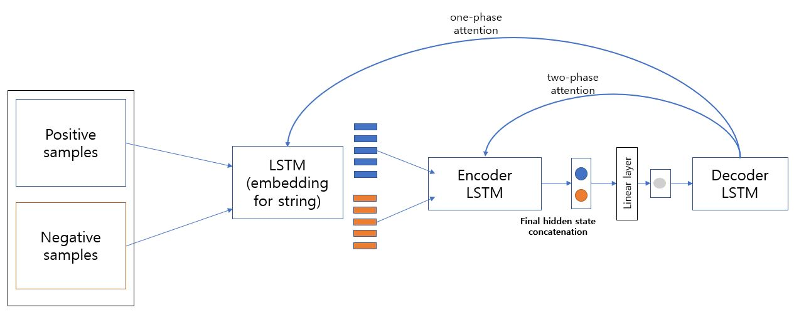

## Model architecture

## Result
- our model (unidirectional model)

|   |string equal|dfa equal|membership equal|total|
|------|---|---|---|---|
|star0|0|0|-|-|
|star1|0|0|-|-|
|star2|0|0|-|-|
|star3|0|0|-|-|

- our model (bidirectional model)

|   |string equal|dfa equal|membership equal|total|
|------|---|---|---|---|
|star0|213|1|-|10.7%|
|star1|67|15|-|4%|
|star2|6|6|-|-|
|star3|10|6|-|-|

- our model( bidirectional + attention(only positive samples))

|   |string equal|dfa equal|membership equal|total|
|------|---|---|---|---|
|star0|1017|3|-|51%|
|star1|444|93|-|26.8%|
|star2|221|79|-|15%|
|star3|133|80|-|10.6%|

-  our model( bidirectional + attention(both positive and negative samples))

|   |string equal|dfa equal|membership equal|total|
|------|---|---|---|---|
|star0|994|1|-|49.75%|
|star1|418|84|-|25.15%|
|star2|224|78|-|15%|
|star3|139|62|-|10.06%|
